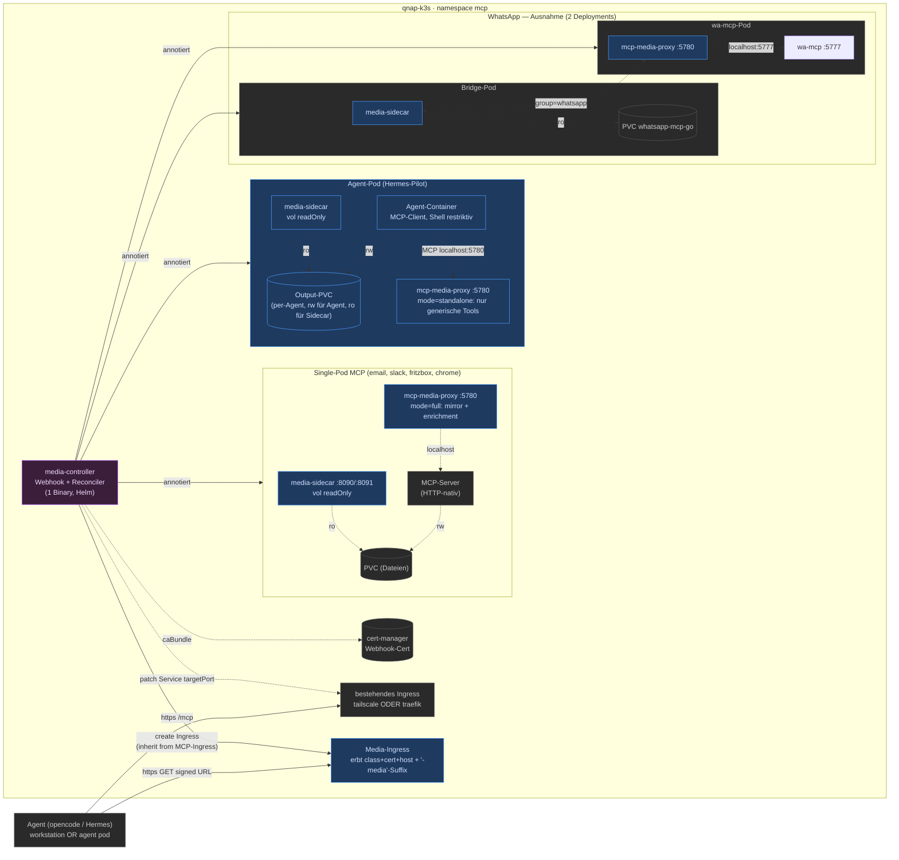

# mcp-media

Generic MCP media egress: a sidecar + proxy + Kubernetes controller that exposes
media files trapped inside isolated MCP-server pods via short-lived HMAC-signed
download URLs — without forking each MCP server.

Wave 6 adds agent pods as a first-class consumer: agents migrated to Kubernetes
(Hermes, opencode, …) use the same proxy in **standalone mode** as their egress
surface — typed MCP tool calls, no shell, no mint token in the agent container.

## Status

🚧 **Wave 3 in progress.** Shipped: sidecar core (Wave 1), proxy with both
mechanisms + standalone mode (Wave 2 / T6.1), relative-path volume convention
(T6.3), controller scaffold + mutating webhook injection (T3.1/T3.2).
Next: Reconciler (Service/Ingress), E2E, deployment.
See [docs/plans/2026-08-20-mcp-media.md](docs/plans/2026-08-20-mcp-media.md)
for the full implementation plan.

## Architecture

### The three egress mechanisms (one tool surface, three roles)

| # | Mechanism | Where | Mode | Trigger |
|---|---|---|---|---|
| 1 | **Enrichment middleware** | MCP-server pods | `PROXY_MODE=full` | Automatic: matching tool results with a path field (`file_path`/`path`/`filename`) gain `{url, mime_type, size_bytes}` + URL text — no tool changes needed |
| 2 | **Generic tools as fallback** | MCP-server pods | `PROXY_MODE=full` | Explicit: agent calls `stream_media(path)` / `download_file(path)` when enrichment does not fire |
| 3 | **Standalone** | Agent pods | `PROXY_MODE=standalone` | Only mechanism: proxy exposes *only* the generic tools; no upstream mirroring, no enrichment |

Design constraint (Wave 6): the agent container **never receives the mint
token** — egress runs exclusively through MCP tool calls, so agents keep
working with a fully restricted shell.

### Components

| Binary | Role |
|---|---|
| `media-sidecar` | Data plane: file server (:8090) + mint API (:8091), mounts the media volume read-only |
| `mcp-media-proxy` | Control plane: terminates MCP (official Go SDK), mirrors upstream tools (full mode) or serves only the generic tools (standalone mode), enriches tool results via middleware |
| `example-mcp` | Reference MCP server returning `/tmp/hello-world.txt` — test fixture |
| `probe` | Smoke-test client for E2E |
| `media-controller` | kubebuilder controller: MutatingWebhook (sidecar/proxy injection) + Reconciler (Service + inherited Ingress) |

### Volume conventions

- **MCP-server pods:** the annotated PVC is mounted **read-only** into the
  sidecar; the MCP server writes it as before.
- **Agent pods (Wave 6):** the per-agent output PVC is mounted read-write by
  the agent and read-only by the sidecar. Agents name files **relative to the
  volume root** — `serve.Resolve` joins relative paths against the first
  configured root, so the agent never needs pod-internal mount paths.
- **Isolation:** one PVC per agent is the default; shared PVCs across pods
  use the `group` mechanism.

### Ingress inheritance

The Reconciler finds the workload's existing Ingress (backend-service match),
copies `ingressClassName` + cert-manager cluster-issuer annotation + host
schema, and appends a `-media` suffix. Live: `tailscale` (auto-TLS); public:
`traefik` + `letsencrypt-dns` + `*.mcp.glue-it.de`. Both work out of the box.
Overrides: `media.media/ingress-class` / `ingress-host` / `cert-issuer` /
`ingress-tls-secret`.

## Annotation reference

| Annotation | Default | Effect |
|---|---|---|
| (Namespace label) `media-injection: enabled` | — | enables the webhook for the namespace |
| `media.media/inject-sidecar: "true"` | — | inject the file-server container |
| `media.media/inject-proxy: "true"` | — | inject the MCP-proxy container |
| `media.media/volume-name` | emptyDir | PVC for the sidecar readOnly mount (`empty` → emptyDir) |
| `media.media/volume-path` | `/data` | mount path in the sidecar |
| `media.media/upstream-port` | main container port (auto) | proxy upstream `http://localhost:<port>` |
| `media.media/proxy-mode` | `full` | `standalone` = generic tools only (agent pods) |
| `media.media/tool-match` | — | regex for the enrichment middleware (full mode only) |
| `media.media/mint-url` | derived | explicit proxy `MINT_URL` override |
| `media.media/public-url` | derived | `MEDIA_PUBLIC_BASE_URL` in the sidecar |
| `media.media/inline-max-bytes` | `102400` | base64-inline limit |
| `media.media/group` | — | links sidecar + proxy across deployments (split) |
| `media.media/ingress-class` | inherit | override media Ingress class |
| `media.media/ingress-host` | inherit + `-media` | override media host |
| `media.media/cert-issuer` | inherit | override cert-manager ClusterIssuer |
| `media.media/ingress-tls-secret` | inherit | override TLS secret |

Injection marks the pod template with the label `media.media/injected: "true"`
(the Reconciler watch signal).

**Single-pod (normal):** `inject-sidecar` + `inject-proxy` on the same pod;
proxy mints via `localhost:8091`.
**WhatsApp split:** sidecar on the bridge, proxy on wa-mcp, linked via
`group: whatsapp`; proxy mints via `<group>-sidecar-service:8091`.

## Security model

- Signed URLs: HMAC-SHA256 over `{pathB64, exp, disposition}`; TTLs clamped
  to [300s, 900s]; expired → 403.
- Path fencing: lexical Clean + `EvalSymlinks` + root prefix checks; escapes →
  403, missing → 404. Relative paths resolve against the first root only.
- Mint API: bearer-token (constant time), 4 KiB request cap, strict JSON.
- Webhook: `failurePolicy: Ignore` + namespace label gate; malformed
  annotations never block pod creation.
- No mint token in agent containers; the signing secret lives in the sidecar
  only.
- Signed URLs are never logged; TTL cap and inline limit are enforced.

## License

MIT