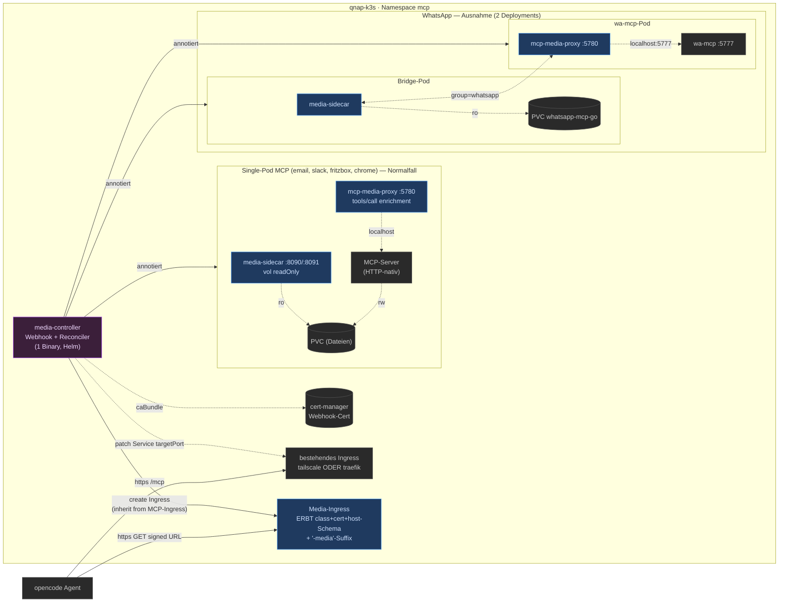

# MCP Media Egress — Implementation Plan (v3: final)

> **For agentic workers:** REQUIRED SUB-SKILL: `superpowers:subagent-driven-development`. Steps use `- [ ]` checkboxes.
> **Plan-Mode-Hinweis:** Dieser Plan wurde read-only entworfen und ist der erste Commit in diesem Repo (Wave 0). Notify→Push-Regel gilt ab hier.

**Goal:** Generischer Mechanismus, der Media-Dateien aus beliebigen isolierten MCP-Pods über kurzlebige HMAC-signierte URLs für den Agent freigibt — gesteuert durch einen K8s-Controller mit Annotations, der Sidecar + Proxy injiziert, Service/Ingress erzeugt und bestehende Tool-Results per Middleware anreichert. Kein Helm-Gefummel pro Chart, kein Forken der MCP-Server. Ingress-agnostisch (tailscale UND traefik) durch Vererbung vom bestehenden MCP-Ingress.

**Architecture:** Ein Repo `gthieleb/mcp-media` mit fünf Binaries:
- `media-sidecar` — Datenplane: File-Server + Mint-API, mountet Volume readOnly.
- `mcp-media-proxy` — Controlplane: terminiert MCP (Go-SDK), leitet an Upstream weiter, injiziert generische Tools (`stream_media`, `download_file`) **UND** reichert per `AddReceivingMiddleware` bestehende Tool-Results (regex-match) um URL/MIME/Size an.
- `example-mcp` — Referenz-Server mit `download_file`-Tool, das `/tmp/hello-world.txt` zurückgibt. Test-Grundlage.
- `probe` — Smoke-Client für E2E-Tests.
- `media-controller` — kubebuilder-Controller: MutatingWebhook (Sidecar/Proxy-Injektion per Annotation) + Reconciler (Service + **geerbtes** Ingress für Sidecar; Service-targetPort-Patch für Proxy).

**Tech Stack:** Go 1.25, `github.com/modelcontextprotocol/go-sdk/mcp` v1.4.1, `sigs.k8s.io/controller-runtime`, kubebuilder, cert-manager (Webhook-Cert), Tailscale-Operator UND Traefik (beide IngressClasses unterstützt via Vererbung), Helm via `kubebuilder edit --plugins=helm/v2-alpha`.

**Validiert:** SDK-Middleware kann `*mcp.CallToolResult` mutieren (`res.Content` appenden, `StructuredContent` mergen) + `req.Params.Name` per Regex matchen (`examples/server/middleware`, `examples/server/proxy`). Controller-Pattern (Webhook + Reconciler in einem Binary) ist kubebuilder-Standard (kagenti-Operator-Vorbild). Chart-Befund: alle 5 MCPs HTTP-nativ (kein stdio-Wrap nötig für MVP), Ingress-Muster = `tailscale` live / `traefik`+`letsencrypt-dns` public — beide via Standard `networking.k8s.io/v1 Ingress`.

---

## Communication Checkpoints

| Kanal | Zweck | ID/URL |
|---|---|---|
| Diese Konversation | Plan-Review, Wave-Status-Updates | hier |
| GitHub `gthieleb/mcp-media` | Commits, Issues, Plan-Datei | https://github.com/gthieleb/mcp-media |
| GitHub `gthieleb/…` (mcp-setup) | Deploy-Annotations auf bestehenden Charts | `~/development/ai/mcp/mcp-setup` |

**Checkpoint-Schedule:** Nach jeder Wave postet der Executor hier:
```
📡 **Wave [N] Complete — [Titel]**
**Done:** … / **Verified:** … / **Next:** … / **Blockers:** …
```
Commit+Push vor jedem Posten. **Delegation:** externe Kommunikation via Subagent mit passendem Skill.

**Execution Skill:** `subagent-driven-development`.

---

## Architektur-Skizze



**Ingress-Vererbung (neu):** Der Reconciler sucht das bestehende Ingress des annotierten Workloads (Backend-Service-Match), kopiert `ingressClassName` + `cert-manager.io/cluster-issuer`-Annotation + Host-Schema (Host bekommt `-media`-Suffix bzw. `<host>-media`), und legt TLS-Secret-Name analog fest. Override per Annotation `media.media/ingress-class`/`ingress-host`/`cert-issuer`/`ingress-tls-secret`. → Live-Betrieb: `tailscale` auto-TLS; Public-Variante: `traefik`+`letsencrypt-dns`+`*.mcp.glue-it.de`. Beides out-of-the-box, ohne dass der Chart-Autor zusätzlich konfigurieren muss.

---

## Annotation-Referenz (komplett, generisch)

| Annotation | Default | Wirkung |
|---|---|---|
| (Namespace-Label) `media-injection: enabled` | — | aktiviert Webhook für Namespace |
| `media.media/inject-sidecar: "true"` | — | File-Server-Container injizieren |
| `media.media/inject-proxy: "true"` | — | MCP-Proxy-Container injizieren |
| `media.media/volume-name` | — | PVC für Sidecar readOnly-Mount |
| `media.media/volume-path` | `/data` | Mount-Pfad im Sidecar |
| `media.media/upstream-port` | Hauptcontainer-Port (auto-detected) | Proxy-Upstream `http://localhost:<port>` |
| `media.media/mcp-service` | auto (Single-Service-Pod) | Service für targetPort-Patch (bei Multi-Service wie chrome-mcp) |
| `media.media/patch-service-port: "<orig>-><proxy>"` | `<upstream>->5780` | targetPort-Patch |
| `media.media/group: <name>` | — | verknüpft Sidecar+Proxy über Deployments (Mint-Service-Auflösung) |
| `media.media/tool-match` | `.*` | Regex für Enrichment-Middleware |
| `media.media/ingress-class` | **erben** vom MCP-Ingress | tailscale/traefik/nginx… |
| `media.media/ingress-host` | **erben** + `-media`-Suffix | Hostname |
| `media.media/cert-issuer` | **erben** | cert-manager-ClusterIssuer-Annotation |
| `media.media/ingress-tls-secret` | **erben** | TLS-Secret-Name |
| `media.media/public-url` | abgeleitet vom Media-Ingress-Host | `MEDIA_PUBLIC_BASE_URL` im Sidecar |
| `media.media/inline-max-bytes` | `102400` | base64-Inline-Limit |

**Normalfall (Single-Pod):** `inject-sidecar: "true"` + `inject-proxy: "true"` auf demselben Pod; Proxy minted über `localhost:8091`.
**WhatsApp-Ausnahme (Split):** Sidecar auf Bridge, Proxy auf wa-mcp, verknüpft via `group: whatsapp`; Proxy minted über `<group>-sidecar-service:8091`.

---

## Test-Strategie

Vier Schichten, je nach Docker-Bedarf und Aussagekraft — kanonisch für kubebuilder v4 + Go-Controller 2026:

| Schicht | Tool | Deckt | Docker? | Wo |
|---|---|---|---|---|
| **Unit** | `go test ./...` | reine Funktionen: Signing, Fencing, MIME, Ingress-Konstruktion, Port-Mapping, Patch-Logik | nein | CI + lokal |
| **Integration** | `envtest` (`setup-envtest`) | Reconciler gegen echten apiserver (erstellt `networking.k8s.io/v1 Ingress` + `Service` — beides built-in) **und** MutatingWebhook-Admission-Pfad (`envtest.WebhookInstallOptions` generiert eigene CA + patcht `caBundle`, kein cert-manager nötig) | nein | CI + lokal |
| **E2E (CI)** | **kind** via `helm/kind-action` + cert-manager + `go test -tags=e2e` | Full-Stack: cert-manager CA-Injection läuft wirklich, Sidecar-Image läuft, Datei wird tatsächlich serviert | ja | CI |
| **E2E (lokal, in-process)** | **testcontainers-go k3s-Modul** | wie CI-E2E, aber via `go test -tags=e2e` ohne Make-Orchestrierung; k3s liefert **Traefik + ServiceLB nativ** → perfekt für die Ingress-Vererbungs-Tests gegen echten Ingress-Controller | ja (Docker) | lokal + CI |
| **Smoke** | realer Cluster (qnap-k3s mit Tailscale-Operator) | echter `IngressClass: tailscale`-Pfad, LE-Cert, MagicDNS | n/a | manuell (Wave 5) |

**Begründete Tool-Wahl:**
- **kind** als CI-Standard (bessere GHA-Integration via `helm/kind-action`, k8s-sigs-Standard). Für `IngressClass: tailscale` im CI: **fake IngressClass** anlegen (`controller: tailscale.com/ingress`) — der Controller prüft nur Existenz/Selektierbarkeit, nicht wer reconciled. Echten Tailscale-Pfad nur als Smoke auf qnap-k3s.
- **testcontainers-go k3s-Modul** als lokale/in-process-Alternative — gibt uns Traefik geschenkt, sodass die Ingress-Vererbung gegen einen **echten** Controller validiert wird (nicht nur "Ingress-Objekt existiert").
- **kuttl** bewusst weggelassen — Go/Ginkgo ist für unsere behavioral Assertions (HTTP-fetch der signierten URL, Range-Check) ausdrucksstärker.
- **cert-manager in envtest**: geht nicht (cainjector läuft nicht) — `envtest.WebhookInstallOptions` ersetzt das durch eigene CA. cert-manager-Annotation-Flow wird **nur in kind** getestet.

### E2E-Test-Suite (`test/e2e/`, Build-Tag `e2e`)

1. **Setup:** Cluster up (kind in CI / testcontainers-k3s lokal) → cert-manager install (nur kind) → Controller-Image laden (`kind load` / `k3sC.LoadImages`, `imagePullPolicy: Never`) → Controller deploy.
2. **Injection-Assert:** annotiere `Namespace` + `Deployment` (Sidecar + Proxy) → `Eventually` pod hat 3 Container → `Service <wl>-media` existiert → `Ingress` existiert mit **geerbtem** `ingressClassName` + Host-Schema (`-media`-Suffix) → `Service` targetPort gepatcht.
3. **Behavioral-Assert:** `kubectl port-forward svc/<wl>-media 8090` → `POST /mint` → URL → `http.Get` → Status 200 + Bytes == `"Hello, World!\n"` + Range-Request → 206 + `Content-Disposition` + `Cache-Control` → expired URL → 403.
4. **Enrichment-Assert:** MCP-Proxy-Port-Forward → SDK-Client `tools/list` enthält example-Tools + generische → `download_file` aufrufen → Result `structuredContent.url` vorhanden → URL fetch == Hello-World-Bytes.
5. **Ingress-Vererbung (nur k3s/Traefik-Pfad):** Deployment mit bestehendem traefik-Ingress → Media-Ingress erbt `ingressClassName: traefik` + Host `example-mcp-media` → Traefik routet tatsächlich.

### GitHub-Actions-Jobs

```yaml
jobs:
  unit:
    runs-on: ubuntu-latest
    steps: [checkout, setup-go@v5, go vet, gofumpt -l, go test ./...]

  envtest:
    runs-on: ubuntu-latest
    steps:
      - checkout, setup-go@v5
      - make setup-envtest      # setup-envtest use <ver> -p path
      - KUBEBUILDER_ASSETS=... go test ./internal/controller/... ./internal/webhook/...

  e2e-kind:
    runs-on: ubuntu-latest
    timeout-minutes: 20
    env: { IMG: media-controller:dev, SIDECAR_IMG: ..., PROXY_IMG: ..., CERT_MANAGER_VERSION: v1.21.1 }
    steps:
      - checkout, setup-go@v5
      - make docker-build IMG=$IMG SIDECAR=$SIDECAR_IMG PROXY=$PROXY_IMG
      - uses: helm/kind-action@v1
      - kind load docker-image $IMG $SIDECAR_IMG $PROXY_IMG --name e2e
      - kubectl apply -f https://github.com/cert-manager/cert-manager/releases/download/${CERT_MANAGER_VERSION}/cert-manager.yaml
      - kubectl wait deploy -n cert-manager --for=condition=Available --all --timeout=120s
      - make install deploy IMG=$IMG   # imagePullPolicy: Never
      - kubectl apply -f test/e2e/fake-tailscale-ingressclass.yaml
      - go test -tags=e2e -timeout 10m ./test/e2e/...
      - if: always()  → kind export logs

  e2e-k3s:  # optional, Traefik-nativ
    runs-on: ubuntu-latest
    steps:
      - checkout, setup-go@v5
      - make docker-build ...
      - go test -tags=e2e -timeout 12m ./test/e2e/...   # testcontainers-go k3s-Modul startet k3s im Test
```

### testcontainers-k3s-Snippet (lokale/in-process-Variante)

```go
func TestE2EInjection(t *testing.T) {
    ctx := context.Background()
    k3sC, _ := k3s.Run(ctx, "rancher/k3s:v1.35.0-k3s1",
        k3s.WithManifest("test/e2e/manifests/controller.yaml"),
        testcontainers.WithAfterReadyCommand(testcontainers.NewRawCommand([]string{
            "kubectl","wait","deploy","-A","--for=condition=Available","--timeout=120s"})))
    defer testcontainers.CleanupContainer(t, k3sC)
    k3sC.LoadImages(ctx, "media-controller:dev","media-sidecar:dev","media-proxy:dev")
    kube, _ := k3sC.GetKubeConfig(ctx)
    // ... client-go, annotate Deployment, Eventually(sidecar-container), port-forward, mint+fetch+Range-assert
}
```

### Pitfalls

| Pitfall | Mitigation |
|---|---|
| cert-manager in envtest nicht verfügbar | envtest nutzt eigene CA via `WebhookInstallOptions`; cert-manager-Flow nur in kind testen |
| Tailscale-Operator im CI nicht lauffähig | Fake-`IngressClass` in kind; echten Tailscale-Pfad nur als Smoke auf qnap-k3s (Wave 5) |
| `kind load` + `imagePullPolicy` | `imagePullPolicy: Never` setzen, sonst Pull-Fail |
| Sidecar-serves-files braucht echten Pod | envtest hat keinen kubelet → zwingt kind/k3s-E2E (Wave 4) |
| testcontainers-k3s-Startzeit | ~20–40s akzeptabel; `WithAfterReadyCommand` wartet auf Controller-Ready |

---

## Wave 0: Bootstrap & Plan-Commit

- [x] Repo `gthieleb/mcp-media` (lokal `~/development/ai/mcp/mcp-media`), Go-Module `github.com/gthieleb/mcp-media`, `go 1.25`. `.gitignore` (`.env`, `*.key`, `*.pem`, `.sisyphus/`, `.hermes/`, `config/`). LICENSE.
- [x] Plan + Architektur-Skizze als `docs/plans/2026-08-20-mcp-media.md` committen + pushen. *(this file)*
- [x] CI `.github/workflows/ci.yml`: `go vet`, `gofumpt -l`, `go test ./...`; bei Tag → Images `ghcr.io/gthieleb/mcp-media-{sidecar,proxy,example,controller}`. *(unit-Job aktiv seit Wave 1; Image-Jobs folgen pro Wave, sobald Dockerfiles landen)*

## Wave 1: Example-MCP + Probe + Sidecar-Kern (TDD-Basis, rein lokal)

- [x] **T1.1 `cmd/example-mcp`:** Go-SDK-Server, Streamable-HTTP `:7777`. Tool `download_file(path)` → `TextContent{"/tmp/hello-world.txt"}`; start schreibt `/tmp/hello-world.txt` = `"Hello, World!\n"`. Kein Volume, keine K8s-Abhängigkeit.
- [x] **T1.2 `cmd/probe`:** verbindet per SDK an URL, printed `tools/list`, ruft Tool auf, lädt ggf. enthaltene URL per `http.Get`, prüft Status+Bytes.
- [x] **T1.3 Signing (TDD):** `internal/sign` — `Sign(secret, pathB64, exp, disposition)` HMAC-SHA256 hex; `Verify` mit `hmac.Equal`. Tests: Roundtrip, Tamper, abgelaufen.
- [x] **T1.4 Fencing (TDD):** `internal/serve.Resolve(roots, path)` — `Clean`, `EvalSymlinks`, Prefix-Check. Tests: Traversal, außerhalb-Roots, Symlink-Escape.
- [x] **T1.5 MIME (TDD):** `internal/mime.For(path)` — Ext-Map + `http.DetectContentType` (512 Bytes).
- [x] **T1.6 File-Server:** `GET /media/{b64url(path)}/{filename}?exp=&d=&sig=` → Verify → `http.ServeContent` (Range/ETag) + `Content-Disposition`, `Cache-Control: private, no-store`, `X-Content-Type-Options: nosniff`. httptest: 200, 206, 403, 404. Keine vollen signierten URLs loggen.
- [x] **T1.7 Mint-API:** `:8091`, `POST /mint {path, disposition, ttl_seconds}` mit `Bearer $MEDIA_INTERNAL_TOKEN` (constant-time). Antwort `{url, expires_at}`. TTL-Clamp Default 300s/Max 900s.
- [x] **T1.8 `media-sidecar` main + Dockerfile** (distroless nonroot). Tag `sidecar-v0.1.0`.

## Wave 2: `mcp-media-proxy` (beide Mechanismen)

- [x] **T2.1 Upstream-Client + Tool-Spiegelung:** persistenter `mcp.ClientSession` via `StreamableClientTransport` zu `UPSTREAM_MCP_URL` (`http://localhost:<upstream-port>`); Tools enumerieren + per `mcp.AddTool` auf eigenem Server registrieren, Handler leiten an `CallTool` weiter. `ToolListChangedHandler` → Re-Sync. Integrationstest mit `example-mcp` (in-process).
- [x] **T2.2 Generische Tools:** `stream_media(path, mode?, ttl_seconds?)` (inline) und `download_file(path, mode?, ttl_seconds?)` (attachment). Handler → Mint-Call → `structuredContent {url, mime_type, size_bytes, filename, expires_at, inline_included}` + URL als `TextContent`; `mode=inline|both` UND `mime∈{image/*,audio/*}` UND `size ≤ INLINE_MAX_BYTES` → zusätzlich `ImageContent`/`AudioContent` base64. Mint-Fehler → `isError:true`. **Vorarbeit aus Wave-1-Integration-Review (I-3):** Mint-Response um `size_bytes` + `mime_type` erweitern (Mint stat'et ohnehin schon; Proxy hat im WhatsApp-Split keinen Volume-Zugriff) — additiv, nicht-brechend, vor T2.2-Implementierung.
- [ ] **T2.3 Enrichment-Middleware (reaktiv):** `AddReceivingMiddleware` — nach `next`, wenn `method=="tools/call"` UND `TOOL_MATCH`-Regex (Env) auf `req.Params.Name` passt UND `res.IsError==false`: scanne `res.Content`/`StructuredContent` nach Pfad-Feldern (`file_path`/`path`/`filename`), minte URL, merge `structuredContent` um `{url, mime_type, size_bytes}`, appende `TextContent{url}`. Keine neuen Tool-Namen nötig. Tests: Match, kein Match (unverändert), `IsError` (unverändert), Pfad-Feld fehlt (unverändert).
- [ ] **T2.4 Downstream-Server:** `mcp.NewServer` + `NewStreamableHTTPHandler` auf `PROXY_LISTEN_ADDR` (`:5780`); stateful.
- [ ] **T2.5 E2E lokal:** `example-mcp :7777` + `proxy :5780` (UPSTREAM=example, MINT=sidecar) → `probe -url :5780`. Erwartet: `tools/list` enthält example-Tools + generische; `download_file` angereichert mit `url`; URL fetch → `Hello, World!\n`. Tag `proxy-v0.1.0`.

## Wave 3: `media-controller` (kubebuilder)

- [ ] **T3.1 Scaffold:** `kubebuilder init`, cluster-scoped RBAC, `cmd/media-controller/main.go`. Webhook-Server + Manager in einem Binary. SelfSigned-Issuer + `Certificate` für Webhook-Serving-Cert; `cert-manager.io/inject-ca-from` auf `MutatingWebhookConfiguration`.
- [ ] **T3.2 MutatingWebhook `/mutate--v1-pod`:** `admission.Handler`, prüft Namespace-Label (zusätzlich via WebhookConfig `namespaceSelector`) + Pod-Annotationen. Patches:
  - `inject-sidecar: "true"` → Container `media-sidecar` (Image, Ports 8090/8091, Env aus Annotations: `volume-name`→volumeMount readOnly, `volume-path`, `public-url`, `tool-match`, Inline-Limit, Secret-Ref), Volume-Quelle (PVC readOnly oder emptyDir).
  - `inject-proxy: "true"` → Container `mcp-media-proxy` (`UPSTREAM_MCP_URL=http://localhost:<upstream-port>`, `MINT_URL` via `group`-Auflösung, `TOOL_MATCH`, Token).
  - `failurePolicy: Ignore`, `sideEffects: None`, `reinvocationPolicy: IfNeeded`. Setzt Label `media.media/injected: "true"` auf Pod-Template (Reconciler-Watch).
- [ ] **T3.3 WorkloadReconciler:** watcht `Deployment`/`StatefulSet` mit Label `media.media/injected: "true"`. Pro annotiertem Workload `CreateOrUpdate` (Owner-Ref):
  - bei `inject-sidecar`: `Service <workload>-media` (:8090 serve, :8091 mint) + **`Ingress` mit Vererbung**:
    1. Override-Annotationen prüfen (`ingress-class`, `ingress-host`, `cert-issuer`, `ingress-tls-secret`).
    2. Sonst: bestehendes Ingress des Workloads finden (Backend-Service-Match), `ingressClassName` + `cert-manager.io/cluster-issuer` + Host-Schema kopieren, Host `-media`-Suffix, TLS-Secret analog.
    3. Fallback: `ingressClassName: tailscale`.
    Backend: nur `:8090`.
  - bei `inject-proxy`: patche existierenden Service (`mcp-service` oder auto-detected) targetPort `<upstream>→5780`.
  - `group`: Sidecar-Services mit Label `media.media/group=<g>`; Proxy `MINT_URL=<group-sidecar-service>:8091`.
- [ ] **T3.4 Config/Values:** Controller-Env: Sidecar-/Proxy-Image+Tag, Secret-Name. Helm-Chart via `kubebuilder edit --plugins=helm/v2-alpha`; `values.yaml`: `sidecar.image`, `proxy.image`, `watchNamespaces`, `webhook.certManager.issuer`. Namespace-Scoping via `cache.DefaultNamespaces`.
- [ ] **T3.5 Controller-Tests:** envtest-Webhook-Test (annotierter Pod → patch enthält erwartete Container/Volumes); Reconciler-Test mit Fake-Ingress (Fake-Deployment + bestehendes tailscale-Ingress → neues Media-Ingress erbt class+host+cert; Fake-Deployment + traefik-Ingress → erbt traefik+letsencrypt-dns+`*.mcp.glue-it.de`-Host). Tag `controller-v0.1.0`.

## Wave 4: E2E-Tests (`test/e2e/`, Build-Tag `e2e`)

- [ ] **T4.1 Suite-Gerüst:** `test/e2e/e2e_test.go` mit Build-Tag `e2e`; Helper für client-go, port-forward, Eventually-Polling.
- [ ] **T4.2 kind-E2E (CI):** GHA-Job `e2e-kind`: `helm/kind-action`, cert-manager install, fake-tailscale-IngressClass, Controller+Sidecar+Proxy-Images laden (`kind load`, `imagePullPolicy: Never`), Controller deploy, `go test -tags=e2e`.
- [ ] **T4.3 k3s-E2E (lokal, testcontainers):** GHA-Job `e2e-k3s` bzw. lokales `go test -tags=e2e`; testcontainers-go k3s-Modul startet k3s (Traefik nativ), lädt Images via `k3sC.LoadImages`, applyt Controller-Manifest.
- [ ] **T4.4 Assertions:** Injection-Assert (3 Container, Service, Ingress mit geerbter class), Behavioral-Assert (mint → URL → 200, Range→206, expired→403, Content-Disposition, Cache-Control), Enrichment-Assert (tools/list + structuredContent.url), Ingress-Vererbung-Traefik (k3s-only: Traefik routet tatsächlich).
- [ ] **T4.5** CI-Jobs in `.github/workflows/ci.yml` aktivieren (unit + envtest + e2e-kind + e2e-k3s).

## Wave 5: Deployment qnap-k3s + E2E-Smoke + Doku

- [ ] **T5.1 Controller installieren:** Helm install `media-controller` in ns `media-system`; Secret `media-signing` (32+ random), `media-internal-token`. cert-manager + Tailscale-Operator + Traefik bereits vorhanden (verified).
- [ ] **T5.2 WhatsApp annotieren** (mcp-setup-Repo values): Namespace `mcp` Label `media-injection: enabled`; `whatsapp-mcp-go-wa-bridge` Pod-Template: `inject-sidecar: "true"`, `volume-name: whatsapp-mcp-go`, `volume-path: /project/store`, `group: whatsapp`; `whatsapp-mcp-go-wa-mcp` Pod-Template: `inject-proxy: "true"`, `group: whatsapp`, `tool-match: "^(download_media|send_audio_message)$"`, `patch-service-port: "5777->5780"`. Media-Ingress erbt vom bestehenden whatsapp-Ingress (tailscale live / traefik public).
- [ ] **T5.3 Verifikation:** `helm upgrade` mcp-setup; `kubectl rollout status`; `kubectl get pods -n mcp -l media.media/injected=true`; `kubectl get svc,ingress -n mcp | grep media`. Vom Workstation:
  ```bash
  probe -url https://whatsapp-mcp-go.tail6a9722.ts.net -tool stream_media -path /project/store/<jid>/audio_*.ogg
  curl -r 0-99 "<signed-url>"   # → 206 (Range)
  curl "<expired-url>"          # → 403
  ```
  Rollback: `helm rollback`; Annotationen entfernen.
- [ ] **T5.4 Agent-E2E:** `~/.config/opencode/opencode.jsonc` `whatsapp` re-enable (URL unverändert). Flow: `whatsapp__download_media` → Result enthält automatisch `url`+`mime_type`+`size` (Enrichment) → URL fetchen → Whisper-Transkription (ersetzt Helper-Pod-Workflow).
- [ ] **T5.5 Skill rewrite:** `~/.agents/skills/whatsapp-k8s-media/SKILL.md` — neuer Flow; Helper-Pod als Legacy/Fallback.
- [ ] **T5.6 README:** Architektur-Diagramm, Annotation-Referenz, SEP-2631/2532-Alignment-Note (Result-Shape mappt auf `FileValue`; Datenplane bleibt bei Migration), Security-Sektion.

## Security-Audit-Phase (vor finalem Push)

- [ ] `.gitignore` deckt Secrets; nur `.env.example`; keine Placeholder-Werte (Startup-Validierung ≥32 Zeichen).
- [ ] `git diff --cached` Token-Scan; `git log --all --full-history -- '*.env'`.
- [ ] Signierte URLs nirgends geloggt; TTL-Max erzwungen; Inline-Limit aktiv; Webhook `failurePolicy: Ignore`.

## Risiko-Register (Top)

| Risiko | Mitigation |
|---|---|
| `local-path` RWO: Sidecar in Volume-besitzendem Pod | Design: Sidecar-Annotation nur dort; Proxy separat. Single-Pod ohnehin einer. |
| Service-targetPort-Patch zerstört bestehendes Verhalten | Explizite Annotation; Reconciler idempotent + dokumentiert. |
| Webhook down → alle Pod-Creates blockiert | `failurePolicy: Ignore` + `namespaceSelector`. |
| Ingress-Vererbung findet falsches Ingress | Match via Backend-Service-Selektor + Annotation `mcp-service`; Fallback tailscale; explizite Overrides. |
| Enrichment-Middleware verändert Tool-Semantik | Nur `append`+`merge structuredContent` (kein Ersetzen); `IsError`+kein Match → unverändert. |
| Upstream-Session-Multiplexing | SDK-ClientSession konkurrenz-sicher; Fallback: Session-per-Downstream. |

---

**Final:** Generischer Controller, granulare Annotationen (sidecar/proxy unabhängig, `group` für Split), Beide Injektions-Mechanismen (generische Tools + reaktive Enrichment-Middleware), Ingress-Vererbung (tailscale/traefik-agnostisch), Example-MCP als Test-+Referenzserver, HTTP-only MVP (stdio-Wrap später via `upstream-port` nachrüstbar), SEP-2631-ready, vierschichtige Test-Strategie (Unit → envtest → kind-CI → k3s-lokal) + realer-Cluster-Smoke.